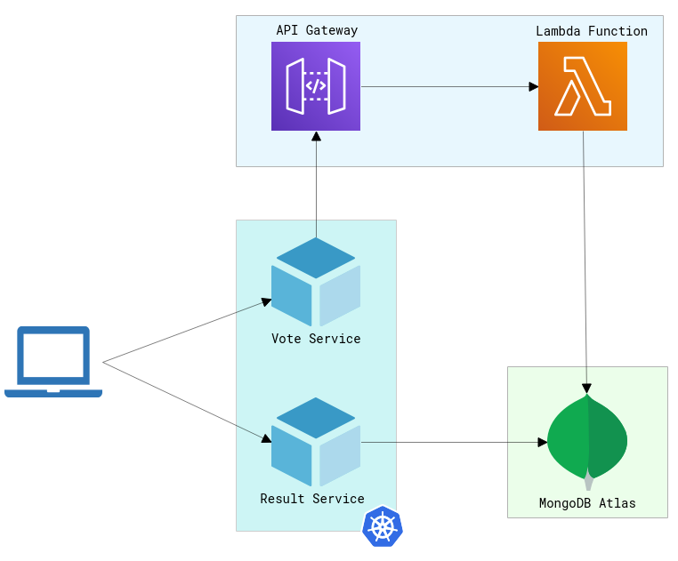

# Mutiple Repos Demo

A demo application that shows how to create a modern development environment that includes:

* A webapp written in Java that lets you vote between Tacos and Burritos.
* A webapp written in Node.js that reads the results form the database and display them in the browser in real time.
* An [AWS Lambda](https://aws.amazon.com/lambda/) function written Python that collects votes and stores them in MongoDB Atlas.
* A [MongoDB Atlas](https://www.mongodb.com/atlas) database.

## Architecture

